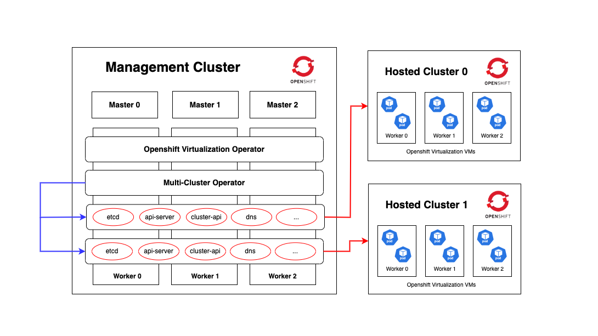

# OCPV Hosted Control Plane Provisioning

This repository contains a procedure for provisioning a hosted control plane on OpenShift Virtualization infrastructure. The following documentation details the steps, configuration options, and troubleshooting guidance while maintaining the structure you already have.

---

## 1. Introduction

Provisioning a hosted control plane in an OpenShift Virtualization environment is designed to separate the management components from the underlying infrastructure. This guide explains how to deploy the control plane in a modular, secure, and scalable manner.

---

## 2. Architecture Overview

The solution is split into distinct layers:

- **Control Plane Components:**  
  Includes the API server, controllers, scheduler, and other critical OpenShift services.
  
- **Infrastructure Layer:**  
  Virtual machines and network resources managed via your virtualization provider.

- **Integration Points:**  
  Secure, reliable connectivity between the control plane and worker nodes with high-availability configurations.

This separation allows for improved maintainability, scalability, and fault tolerance.



---
## 3. Prerequisites

- [x] OCP v4.17

- [x] ODF Installed and configure (default block storage class)

- [x] OCP Virtualization installed and configured

---
## 4. Procedure

### 0 - Installing Muticluster operator

##### 0.1 - Make sure the OCP cluster has wildcard DNS routes enabled
```bash
$ oc patch ingresscontroller default -n openshift-ingress-operator \
  --type=json \
  -p '[
    { 
      "op": "add", 
      "path": "/spec/routeAdmission", 
      "value": { 
        "wildcardPolicy": "WildcardsAllowed" 
      } 
    }
  ]'
```

##### 0.2 - The OpenShift Container Platform management cluster has a default storage class
```bash
$ oc patch storageclass ocs-storagecluster-ceph-rbd \
  -p '{
    "metadata": {
      "annotations": {
        "storageclass.kubernetes.io/is-default-class": "true"
      }
    }
  }'
```

##### 0.3 - Install *"Multicluster Engine for Kubernetes"* Operator

```bash
$ oc create namespace multicluster-engine
```

```bash
$ oc project multicluster-engine
```

```bash
$ oc apply -f - <<EOF
apiVersion: operators.coreos.com/v1
kind: OperatorGroup
metadata:
  name: multicluster-engine-operators
  namespace: multicluster-engine
spec:
  targetNamespaces:
  - multicluster-engine
EOF
```

```bash
$ oc apply -f - <<EOF
apiVersion: operators.coreos.com/v1alpha1
kind: Subscription
metadata:
  name: multicluster-engine
  namespace: multicluster-engine
spec:
  sourceNamespace: openshift-marketplace
  source: redhat-operators
  channel: stable-2.7
  installPlanApproval: Automatic
  name: multicluster-engine
EOF
```

```bash
$ oc apply -f - <<EOF
apiVersion: multicluster.openshift.io/v1
kind: MultiClusterEngine
metadata:
  name: multiclusterengine
spec: {}
EOF
```
NOTE: If this step fails with the following error, the resources are still being created and applied. Run the command again in a few minutes when the resources are created

```text
error: unable to recognize "./mce.yaml": no matches for kind "MultiClusterEngine" in version "operator.multicluster-engine.io/v1"
```

- Run the following command to get the custom resource. It can take up to 10 minutes for the MultiClusterEngine custom resource status to display as Available in the status.phase field after you run the following command:

```bash
$ oc get -o json mce multiclusterengine | jq -r '.status.phase'
```

##### 0.4 - Test if the multicluster engine Operator has at least one managed OCP cluster
🚀  A managed cluster is any cluster that is centrally managed by a control plane, such as Red Hat Advanced Cluster Management (RHACM), OpenShift GitOps, or OpenShift Hosted Control Planes. A key Characteristics of a Managed Cluster is that it can be a full OpenShift cluster or a hosted cluster.

```bash
$ oc get managedclusters local-cluster
```

###  1 - Installing hcp cli
##### 1.0 - Get the URL to download the hcp binary by running the following command:
```bash
$ oc get consoleclidownload hcp-cli-download -o json | jq -r ".spec"
```

##### 1.2 - Download the hcp binary by running the following command:
```bash
$ wget <hcp_cli_download_url> 
Replace hcp_cli_download_url with the URL that you obtained from the previous step.
```
e.i.

```bash
$ wget https://hcp-cli-download-multicluster-engine.apps.ov.sandbox2941.opentlc.com/darwin/amd64/hcp.tar.gz \
  --no-check-certificate
```

##### 1.3 - Unpack the downloaded archive by running the following command:
```bash
$ tar xvzf hcp.tar.gz
```

##### 1.4 - Make the hcp binary file executable by running the following command:
```bash
$ chmod +x hcp
```

##### 1.5 - Move the hcp binary file to a directory in your path by running the following command:
```bash
$ sudo mv hcp /usr/local/bin/.
```

💡 If you download the CLI on a Mac computer, you might see a warning about the hcp binary file. You need to adjust your security settings to allow the binary file to be run.

##### 1.6 - Verification (platform: aws, kubevirt, etc)
```bash
$ hcp create cluster <platform> --help 
```

### 2 - Provisioning a hosted cluster
##### 2.0 - Provisioning hosted cluster
🚀 Along the guest cluster named **guest-cluster-0**, a namespace named **hcp** is being created 
```bash
$ hcp create cluster kubevirt \
  --name guest-cluster-0 \
  --namespace hcp \
  --node-pool-replicas 3 \
  --pull-secret pull-secret.json \
  --memory 10Gi \
  --cores 8 \
  --release-image quay.io/openshift-release-dev/ocp-release:4.17.0-multi \
  --etcd-storage-class=ocs-storagecluster-ceph-rbd
```

🚀 Verify that the hosted control plane pods are running in the HOSTED_CLUSTER_NAMESPACE, these are the pods that run the control plane of the managed cluster.
```bash
$ oc get pods -n hpc-guest-cluster-0
```

- How the namespaces fit into the architecture

#### 🚀 Namespace Breakdown in OpenShift HCP (Hypershift)

| Namespace                 | Location             | Purpose |
|---------------------------|---------------------|---------|
| **`hcp`**                 | Management Cluster  | Controls the hosted control plane custom resource|
| **`guest-cluster-0`**     | Management Cluster  | Stores metadata and API objects for the hosted cluster |
| **`hcp-guest-cluster-0`** | Hosted Cluster      | Runs worker nodes and workloads |

---

#### 🌍 Where Each Component Runs

| **Component**             | **Lives In Namespace**          | **Where It Runs** |
|---------------------------|--------------------------------|-------------------|
| **Hosted Control Plane**  | `hcp` (Management Cluster)     | **Management Cluster** |
| **MachinePool / NodePool** | `hcp` (Management Cluster)    | **Controls Hosted Cluster Workers** |
| **Worker Nodes**    | `hcp-guest-cluster-0`         | **Hosted Cluster** |
| **KubeVirt VMs**          | `hcp-guest-cluster-0`         | **Hosted Cluster Worker Nodes** |

---


##### 2.1 - Checking the status of the hosted cluster

- To list all resources **inside the management cluster** (Hosting Cluster)
```sh
oc get all -n hcp
```

🚀 A hosted cluster (guest-cluster-0) is a cluster that only runs worker nodes, its control plane and API endpoint hosted on a management cluster.

```bash
$ oc get hostedclusters -n hcp
```

### 3 - Accessing the hosted cluster

##### 3.0 - Extracting the hosted cluster credentials
```bash
$ hcp create kubeconfig \
  --namespace <HOSTED_CLUSTER_NAMESPACE> \
  --name <HOSTED_CLUSTER_NAME> > <HOSTED_CLUSTER_NAME>.kubeconfig
```

- Generating the kubeconfig file
```bash
$ hcp create kubeconfig \
  --namespace hcp \
  --name guest-cluster-0 > guest-cluster.kubeconfig
```

- Testing
```bash
$ oc --kubeconfig guest-cluster.kubeconfig get nodes
```

- Extracting the kubeadmin password in the kubeadmin-password in the HOSTED_CLUSTER_NAMESPACE
```bash
$ oc get -o json secret kubeadmin-password -n hcp-guest-cluster-0 \
  | jq -r '.data.password' \
  | base64 -d
```

e.i.

```text
DTLL8-LvWxb-IzhqP-JaiNc
```

##### Adding identity provider
```bash
$ oc edit hostedclusters guest-cluster-0 -n hcp
```

---------------------------------------------------------
## ACM, Monitoring Observability
With RH ACM we can enhance Global Cluster Management for OCP+V. As of ACM 2.12 we can levarage the CMO (Cluster Monitoring Operator). This allows us to add several OCP Virtualization Dashboards in ACC. This finally allows us to observe our entire virtualization Stack at scale.

First things first - we need to setup the Observability CR, an addtional API - in ACM. Besides ACM as of Version 2.12 we also need an S3-API comtable Object Storage. I'm using S3 Storage within my AWS Account.


Having this piece of Storage:
```bash
apiVersion: v1
kind: Secret
metadata:
  name: thanos-object-storage
  namespace: open-cluster-management-observability
type: Opaque
stringData:
  thanos.yaml: |
    type: s3
    config:
      bucket: ocpvbucket
      endpoint: s3.amazonaws.com
      insecure: false
      access_key: xxxxxxxxxxxxxxxxxxxxxxx
      secret_key: xxxxxxxxxxxxxxxxxxxxxxxxxxxxxxxxxx
```


